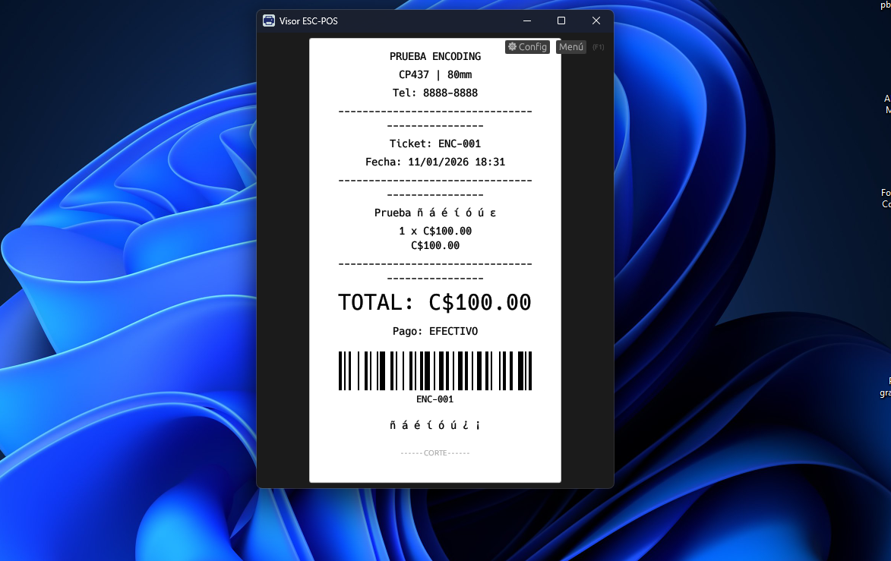
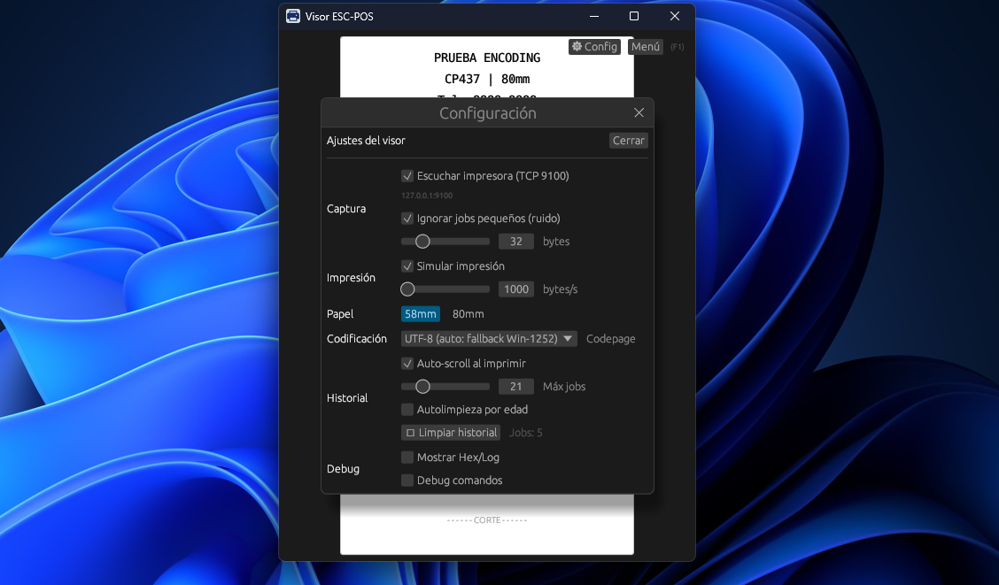
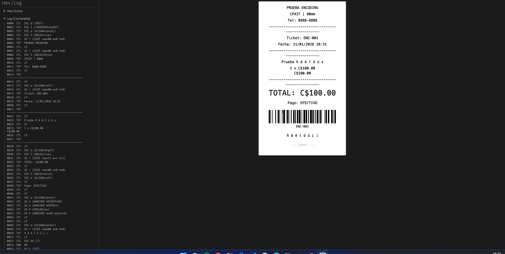

# Visor ESC-POS (escpos_viewer)

Visor de tickets ESC/POS para Windows (Rust + eframe/egui). Captura trabajos de impresión por TCP (puerto 9100), los parsea y los renderiza como un ticket (modo Preview), con historial de trabajos y herramientas de depuración.

**Imagen aquí**

---

## Características

- **Captura por TCP 9100** (127.0.0.1:9100) para funcionar como “impresora virtual”.
- **Modo Preview** (enfocado en el ticket) y **Modo Completo** (controles + debug).
- **Historial de trabajos** con pestañas por job.
- **Simulación de impresión** (revelado progresivo) y auto-scroll durante impresión.
- **System Tray** (bandeja): ocultar/restaurar y auto-abrir al recibir un job.
- **Instancia única** (evita conflicto del puerto 9100).
- **Icono embebido** en exe/ventana/tray.
- **Parser ESC/POS** con soporte para:
  - Texto, saltos de línea, negrita, alineación
  - Tamaño de texto (`GS ! n`)
  - Raster image (`GS v 0`)
  - QR (`GS ( k`)
  - Barcode (`GS k`) con render real (CODE128/EAN8/EAN13/ITF) y HRI (según `GS H`)
  - Corte (`GS V`)
- **Codepage automático**: interpreta `ESC t n` (p.ej. CP437/CP850/Windows-1252) durante el job.

---

## Requisitos

- Windows 10/11
- Rust (stable) instalado: https://www.rust-lang.org/tools/install

---

## Ejecutar en desarrollo

En la raíz del proyecto:

```bash
cargo run
```

Para correr los tests:

```bash
cargo test
```

---

## Uso

### 1) Captura por TCP 9100

1. Abre la app.
2. En `⚙ Configuración` activa **Escuchar impresora (TCP 9100)**.
3. Desde tu POS, imprime hacia una impresora TCP apuntando a `127.0.0.1:9100`.
4. Cada impresión crea un **Job** nuevo en el historial.

> Nota: algunos POS envían “jobs pequeños” como consultas/ruido. El visor puede ignorarlos con **Ignorar jobs pequeños (ruido)**.

### 2) Abrir archivos

Puedes abrir archivos `.prn`, `.bin` o `.txt` con comandos ESC/POS.

### 3) Modos de UI

- **Preview**: pensado para ver solo el ticket.
- **Completo**: muestra controles, historial y paneles Hex/Log.

---

## Configuración (modal)

Abre `⚙ Configuración` para:

- Captura TCP (on/off, filtro de ruido)
- Simulación de impresión (velocidad bytes/s)
- Papel (58mm / 80mm)
- Codificación / Codepage (incluye auto por `ESC t`)
- Historial (auto-scroll, límites, autolimpieza)
- Debug (Hex/Log, debug de comandos)


---

## Codepages y caracteres especiales

- Si tu POS envía `ESC t n`, el visor cambia automáticamente el codepage del job.
- Si no se envía `ESC t`, el visor usa el codepage seleccionado en el modal.

---

## Instalación como impresora virtual (Windows)

El ejecutable soporta comandos para instalar/desinstalar una impresora virtual (requiere permisos de Administrador):

```bash
escpos_viewer.exe --install-printer
escpos_viewer.exe --uninstall-printer
```

> Dependiendo del entorno, este flujo puede requerir drivers/ajustes de Windows.

---

## Estructura del proyecto

- `src/main.rs`: arranque, instancia única, configuración de ventana.
- `src/app.rs`: UI principal, historial de jobs, render del ticket.
- `src/escpos.rs`: parser ESC/POS.
- `src/tcp_capture.rs`: servidor TCP 9100 y captura de jobs.
- `src/window_control.rs`: control Win32 para ocultar/mostrar/foco.
- `src/tray.rs`: System Tray.
- `src/app_icon.rs`, `build.rs`: icono embebido en Windows.

---

## Capturas





- Vista Preview
- Modal de Configuración
- Ejemplo de ticket con barcode/QR

---

## Roadmap (ideas)

- Render adicional de tipos de barcode (UPC-A/UPC-E, Code39, Code93, etc.).
- Mejoras de word-wrap por palabras (títulos largos).
- Persistencia de configuración (último modo, papel, opciones de captura).

---

## Licencia

MIT
